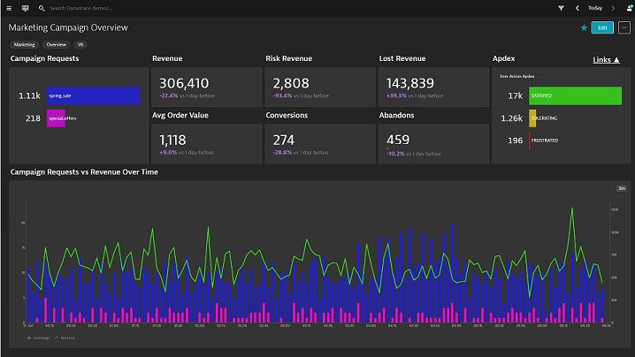
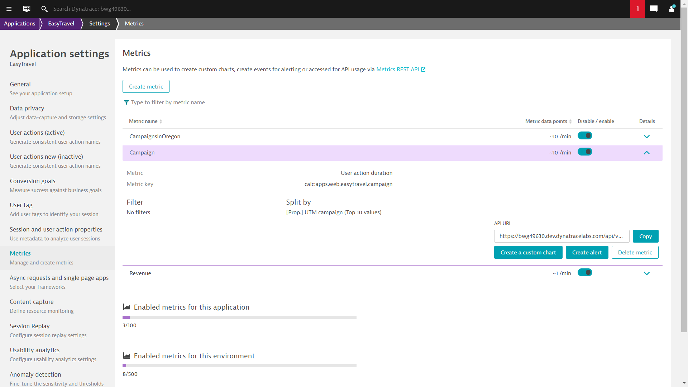
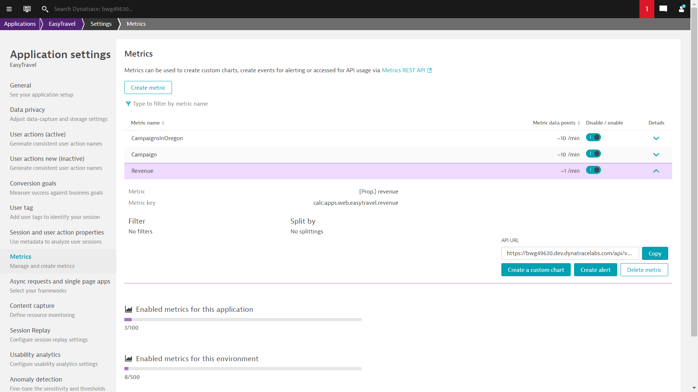
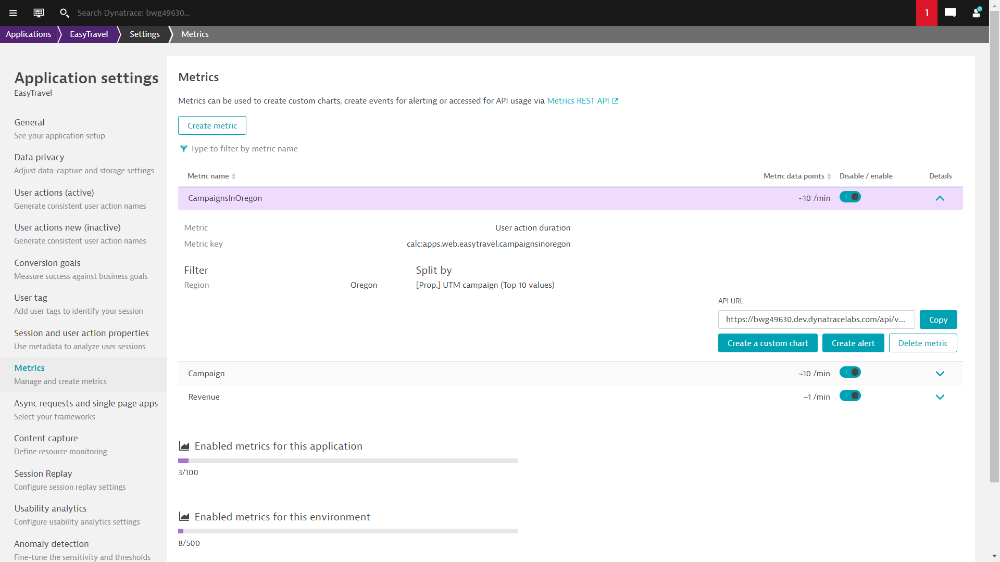

#BizOps Marketing Campaign Analysis Dashboards

This dashboard pack provides a detail analysis for your marketing campaigns. You can see the responses broken down by campain,  
user experience for the campaigns and key KPI data like revenue and conversion for the campaigns. Additional drill downs show  
campaign performance and KPIs across configurable GEOs. You can also drill down to campaign user journeys, fauled campaign  
user journys and abandonded campaign user journeys.

[Prerequisites Video](https://youtu.be/TryamssXZKo "Prereq Video")

[Deployment Video Coming Soon]()

[Usage Video Coming Soon]()

# Prerequisites Highlights

1. Create a session property for your campaign (i.e. Web property pack - web\_utm\_campaign query string)
2. Create a session property for revenue (i.e. revenue - CSS selector)
3. Create a metric for the campaign session property (Metric: Useraction Duration split by Campaign)
4. Create a metric for the revenue session property (Metric Revenue no split)
5. Create 4 additional metrics for each GEO location (Metric: Useraction Duration split by Campaign Filter by continent, region, etc)
6. Mark the last user action step as a key user action for the user journey

# Create Metric for Campaigns

# Create Metric for Revenue

# Create Metric for Campaign by GEO

