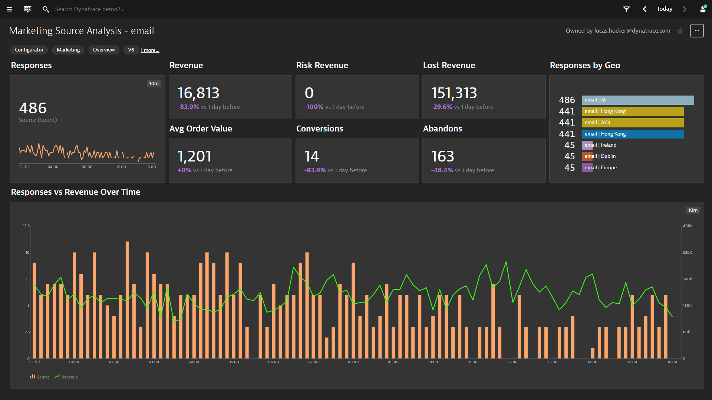

# BizOps Marketing Source Analysis Dashboards

This dashboard pack provides a detail analysis for your marketing campaign sources. You can see the responses broken down by a specific  
campain, campaign responses by GEO and key KPI data like revenue and conversion for the campaigns.  

[Prerequisites Video](https://youtu.be/TryamssXZKo "Prereq Video")

[Deployment Video Coming Soon]()

[Usage Video Coming Soon]()

# Prerequisites Highlights

1. Create a session property for your campaign (i.e. Web property pack - web\_utm\_campaign query string)
2. Create a session property for your campaign source (i.e. Web property pack - web\_utm\_source query string)
3. Create a session property for revenue (i.e. revenue - CSS selector)
4. Create a metric for the campaign session property (Metric: Useraction Duration split by Campaign)
5. Create a metric for the campaign source session property (Metric: Useraction Duration split by Source)
6. Create a metric for the revenue session property (Metric Revenue no split)
7. Mark the last user action step as a key user action for the user journey
